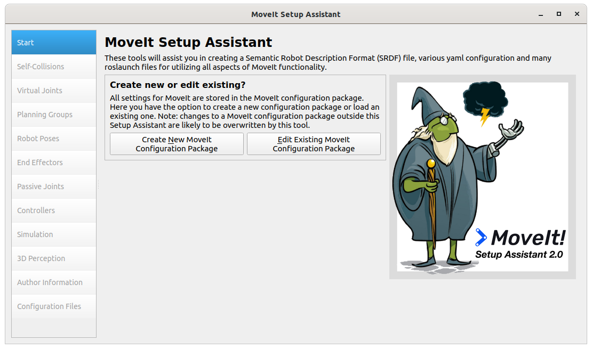
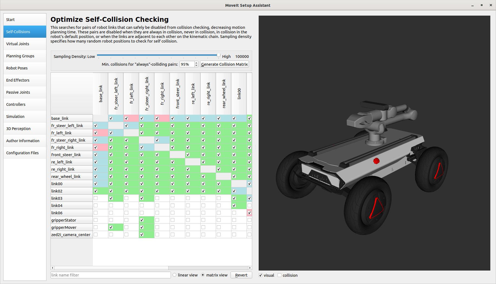
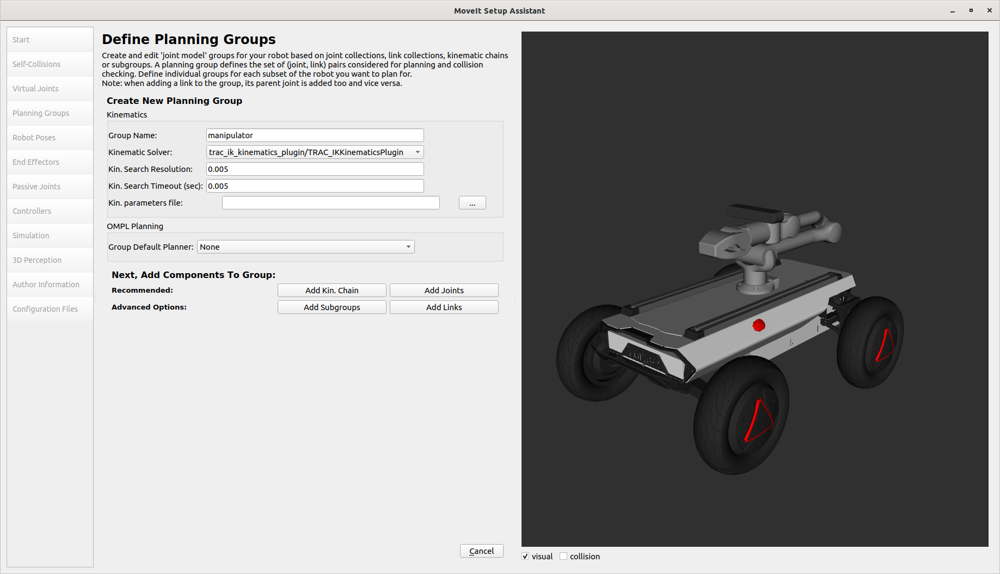
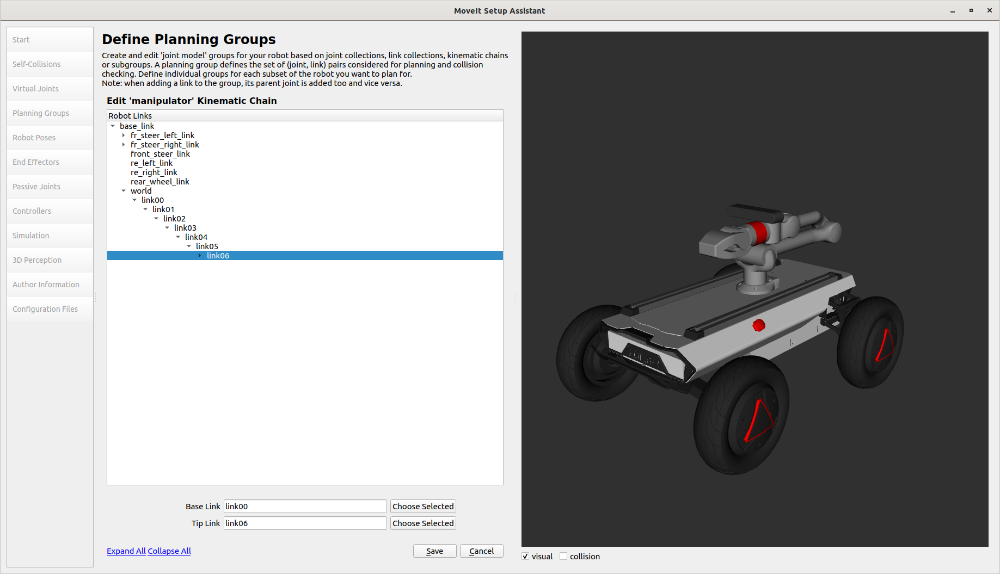
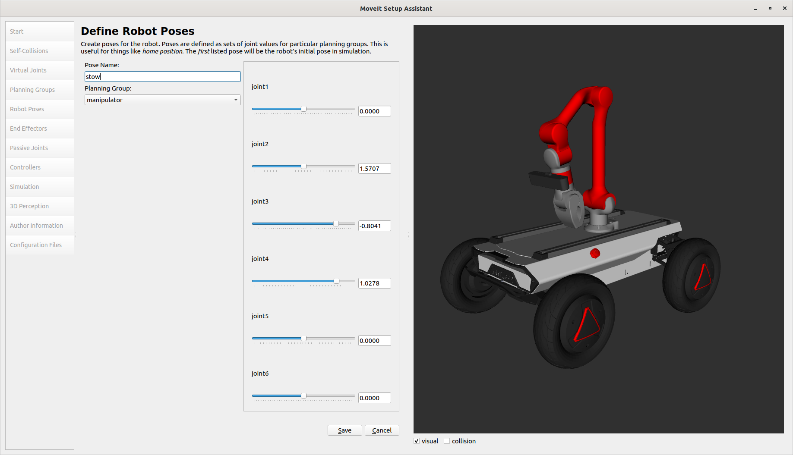
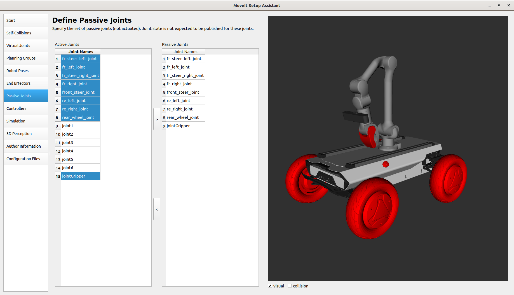
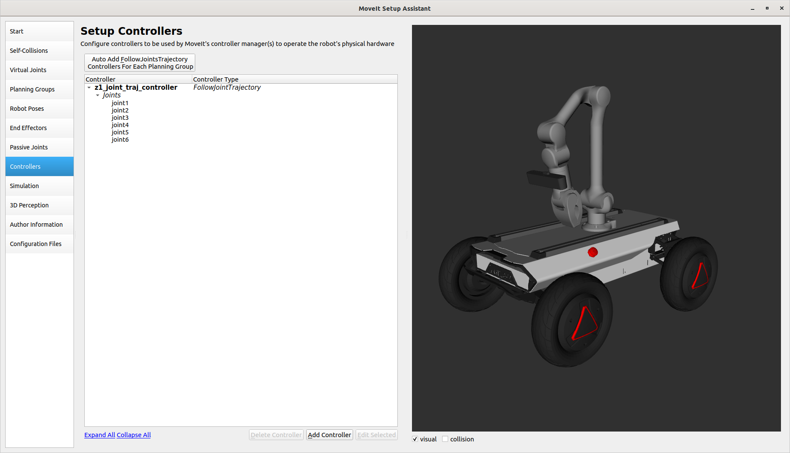
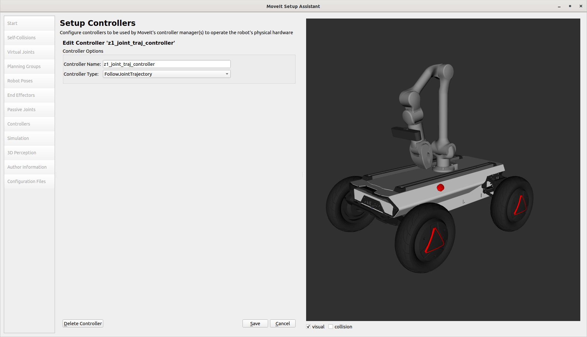
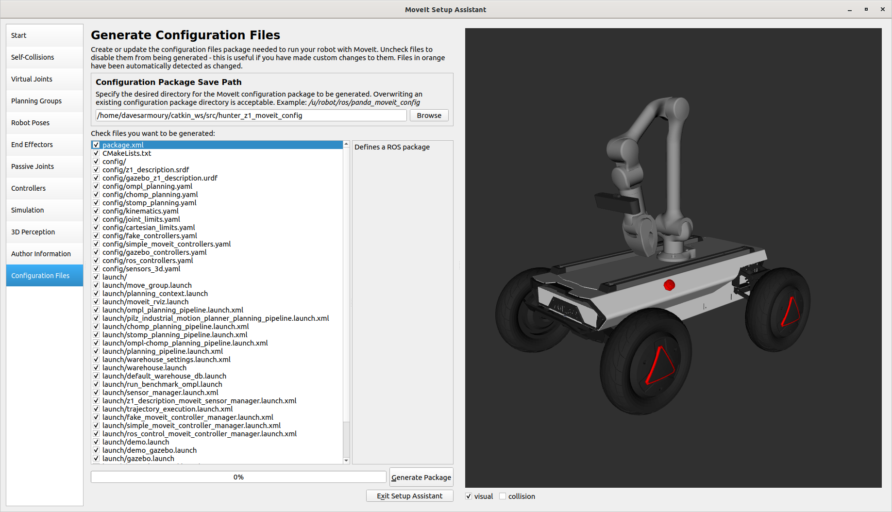

# Custom MoveIt Configuration

When adding hardware to the arm or integratinig it onto another platform, you may need to update the MoevIt configuration.  

## URDF

We're going to create a custom URDF for our robot.  This example will use a [ZED2i](https://www.stereolabs.com/zed-2i/) camera and mount it all on a [Hunter SE](https://global.agilex.ai/products/hunter-se).  Below is the basic urdf needed.  Note the "name" inside the robot tag.

    <?xml version="1.0"?>

    <robot name="hunter_z1" xmlns:xacro="http://ros.org/wiki/xacro">
        <xacro:include filename="$(find hunter_se_description)/urdf/hunter_se_description.urdf" />
        <xacro:include filename="$(find z1_description)/xacro/robot.xacro" />

        <joint name="z1_mount_joint" type="fixed">
            <origin xyz="0 0 0" rpy="0 0 0" />
            <parent link="base_link" />
            <child link="world" />
        </joint>

        <xacro:include filename="$(find zed_wrapper)/urdf/zed_macro.urdf.xacro" />

        <xacro:zed_camera name="zed2i" model="zed2i" parent="link06">
        <origin xyz="0.02 0 0.04" rpy="0 0 0" />
        </xacro:zed_camera>

    </robot>

## Setup Assistant

Once we have our URDF, we can create the MoveIt configuration to plan and control the motions of the arm.  If the name of the robot's URDF is `z1_description`, you can update the configuration using `roslaunch z1_moveit_config setup_assistant.launch`, however, if your main URDF has a different name, you will need to run the setup assistant using `roslaunch moveit_setup_assistant setup_assistant.launch`.  We are going to assume you are creating a new MoveIt configuration

Once it's open, select *Create New MoveIt Configutation Package*.  It should load your URDF and display it on the right side.

## Collision Matrix

When planning motions, MoveIt will avoid collosions.  To make the collision checking more efficient, a first-pass is done in the setup assistant to remove some possible collisions from the checks.  This will remove bodies that will never collide, are always colliding, or are colliding by default. 

Under *Self-Collisions*, drag the *Sampling Density* to the max and press *Generate Collision Matrix*

You can likely un-check any of the collisions marked in red that involve the arm.  We want to be able to avoid these collisions, even if the zero-state of the arm is colliding.

## Planning Groups

Under *Planning Groups*, select *Add Group*.  This is the group of joints that MoveIt will monitor and try to control.

It's common to name the group "manipulator", but you can name it anything you want.  There are also multiple kinematic solvers available.  We recommend using [trac_ik](http://wiki.ros.org/trac_ik) for its speed and flexibility. Next, add some joints to this group by clicking *Add Kin Chain*.  Select link00 as the Base Link and link06 as the Tip Link.

## Robot Poses

This is where you can define custom pre-recorded positions for the arm to move to.  These are handy for a "stow" position when moving the mobile base, or positions that the arm will return to often.  You don't need to set these

## Passive Joints

Because this arm is on a mobile base that has joints of its own, it's good practice to tell MoveIt to ignore those joints.  Under the list of joints, select all except the 6 axes of the arm and copy them to the right list using the arrow button.

## Controllers

To let the MoveIt configuration actually use the ROS controller to move the arm, we need to link it here.  Press *Auto Add FollowJointsTrajectory* at the top to automatically create a controller.  Once it's created, select it and press *Edit Selected*.

Change the name of the group to be **z1_joint_traj_controller** and the type to *FollowJointTrajectory*

## Export Package

Make sure to enter your details under the *Author Information* tab, then navigate to *Configuration Files*.  Add the name of your package to the *Configuration Package Save Path* and press **Generate Package**

Once your package is exported into the src folder of your workspace, you will need to rebuild your workspace so ROS can find it.  After that, it can be launched using:

    roslaunch <package_name> move_group.launch