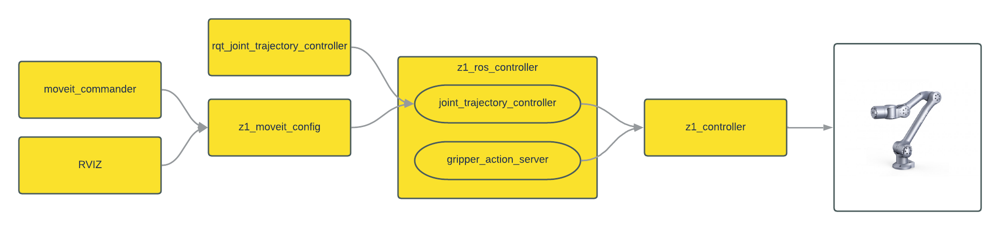

# Z1 ROS

## Packages

* unitree_z1_ros - Metapackage that includes these packages
* z1_bringup - Simple launching package for starting necessary components of the driver
* z1_controller - Hardware interface between robot and Z1 SDK
* z1_moveit_config - Example configuration for using MoveIt with a Z1 arm
* z1_ros_control - Main controller between Z1 SDK and ROS.  Creates a joint_trajectory_controller for the arm and an action server for the gripper
* z1_viz - Simple RVIZ launches and configurations for displaying a currently running arm, or the URDF to verify the setup

## Simulated Robot Arm

    roslaunch z1_bringup simulated_arm.launch

### Parameters

* **gazebo** Launch default Gazebo simulation for the Z1 (Default: True)
* **controller** Launch z1_controller (Default: True)
* **ros_controller** Launch z1_ros_controller (Default: True)
* **moveit** Launch default moveit configuration (Default: True)
* **rviz** Launch RVIZ for monitoring and controlling the Z1 with Moveit (Default: False)
* **UnitreeGripperYN** Does the arm have a default Z1 gripper installed? (Default: True)

## Real Robot Arm

    roslaunch z1_bringup real_arm.launch 

### Parameters

* **controller** Launch z1_controller (Default: True)
* **ros_controller** Launch z1_ros_controller (Default: True)
* **moveit** Launch default moveit configuration (Default: True)
* **rviz** Launch RVIZ for monitoring and controlling the Z1 with Moveit (Default: False)
* **UnitreeGripperYN** Does the arm have a default Z1 gripper installed? (Default: True)

## Configuration

The default configuration for communicating with the arm is at `z1_controller/config/config.yaml`.  This is used for z1_controller

    udp_to_mcu:
        mcu_ip: 192.168.123.110
        controller_port: 8881

    udp_to_sdk:
        sdk_ip: 127.0.0.1
        controller_port: 8072

    collision:
        open: false
        torque_threhold: 10.0
        payload: 0.03

There is a similar config at `z1_ros_control/config/config.yaml`.  This tells z1_ros_control how to communicate with z1_controller

    udp_to_sdk:
        sdk_ip: 127.0.0.1
        controller_port: 8072

If you are running z1_controller and z1_ros_control on the same machine with a single arm, you will not have to change these.  This should only be necessary when working with multiple arms

## Known Issues

* Gripper in simulation doesn't move properly
* Gripper in reality always moves with max force and speed
* URDF joint limits don't seem to match SDK/arm limits

Next step - [Setup](./setup.md)