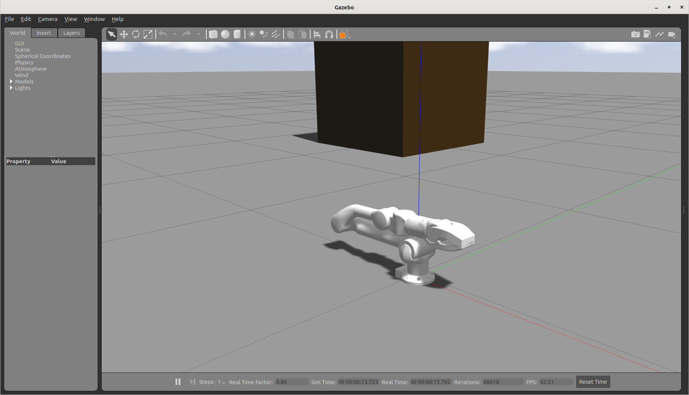
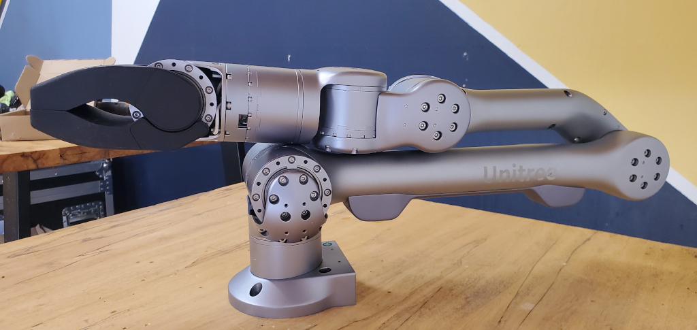
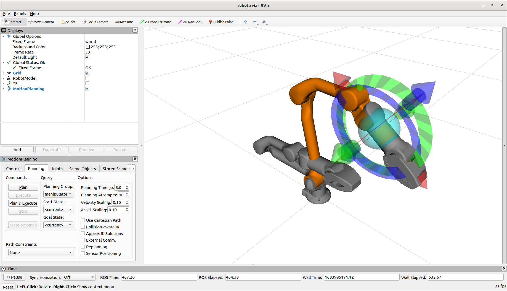
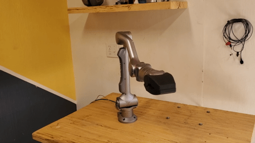
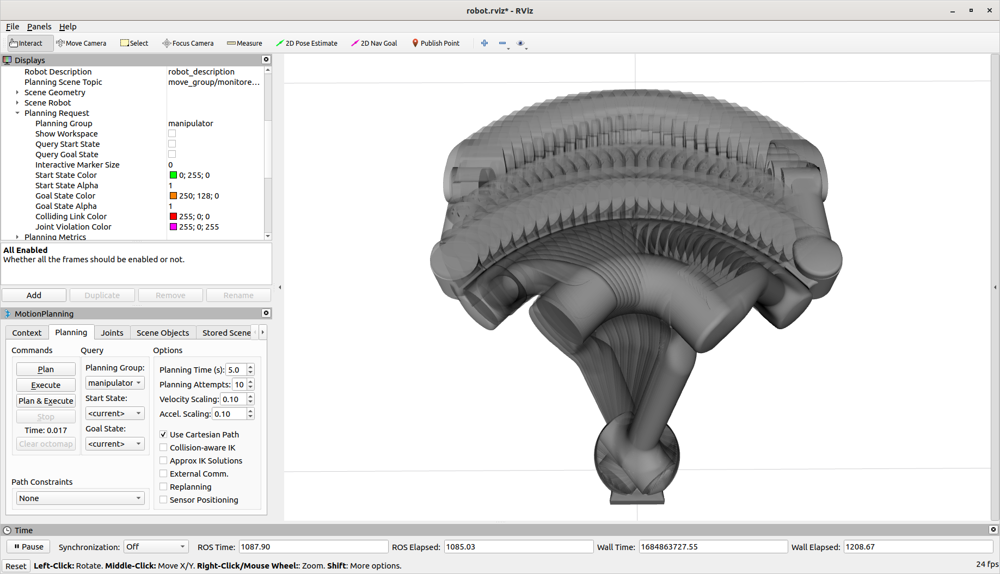
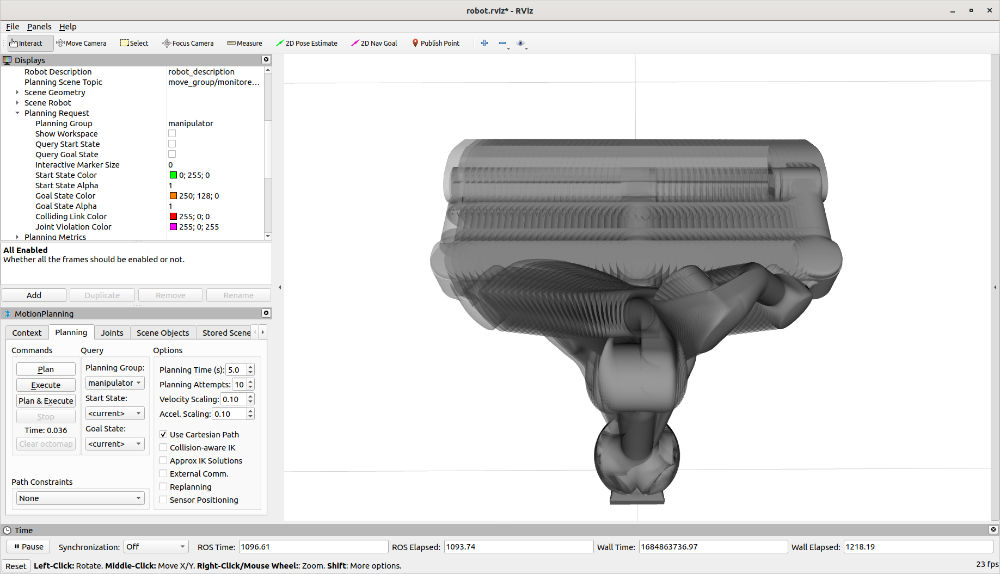
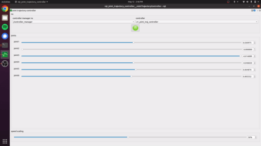
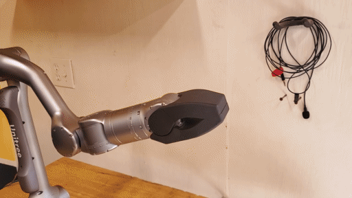

# Z1 ROS Usage

## Simulation

If you aren't using a real robot arm, you can simulate an arm in Gazebo.  *z1_bringup* provides two launch files, one for a real arm and one for a simulation.  

    roslaunch z1_bringup simulated_arm.launch

This command will start:

* A Gazebo Simulation
* The Z1 SDK controller for a simulated arm
* The Z1 ROS controller
* The default Moveit Configuration

Any of these can be disabled using the launch parameters

## Real Arm

The process to conect to a real arm is the same as above, but instead of launching a simulation with Gazebo, it will connect to the arm directly.  Make sure you've followed the [Setup](./setup.md) section first.

    roslaunch z1_bringup real_arm.launch

This command will start:

* The Z1 SDK controller for a real arm
* The Z1 ROS controller
* The default Moveit Configuration

Any of these can be disabled using the launch parameters

## Moveit

MoveIt provides a lot of functionality that can greatly speed up development-time:

* Motion Planning
* Manipulation
* Inverse Kinematics
* Control
* 3D Perception
* Collision Checking

An example MoveIt configuration is included in the *z1_moveit_config* package.  It is started by default with either of the launch scripts above, or can be manually started with

    roslaunch z1_moveit_config move_group.launch

### RVIZ

When it is running, there are many ways to interact with MoveIt.  The most interactive way is to use RVIZ.  RVIZ can be started with the above launch scripts using the launch parameter, or can be started after using:

    roslaunch z1_viz view_robot.launch

If you are running RVIZ from another computer, make sure to follow [ROS Network Setup](http://wiki.ros.org/ROS/NetworkSetup)

In RVIZ, you can move the interactive marker on the end of the arm to position the arm where you need it.  MoveIt will calculate the inverse kinematics to achieve the position.  Clicking Plan will plan the motion from the start to the goal position.  If there are any known obstacles or collisions along the path, MoveIt will plan around them.  Pressing Execute will pass the planned path to the joint_trajectory_controller and move the arm!

.. note::

    If you want to plan and execute **linear** motions, enable *Use Cartesian Path* under the *Planning* tab.

### Moveit Commmander

A simple way to interact with MoveIt programmatically is through [Moveit Commander](https://ros-planning.github.io/moveit_tutorials/doc/moveit_commander_scripting/moveit_commander_scripting_tutorial.html).  It is an interface to Moveit that can be used with either Python or C++.

First, install Moveit Commander with 

    sudo apt install ros-noetic-moveit-commander

Below is a simple script that will move the arm to a position in joint-space. Once it is there, it will plan a linear motion to the opposite side.  If planning succeeds, it will then move the arm in a straight line across the front.  There is a lot that Moveit and Moveit Commander can do.  This is a very basic example.  Copy this into a python script and execute it using Python3

    #!/usr/bin/env python3

    import copy
    import rospy
    import sys
    import moveit_commander

    ## First initialize `moveit_commander`_ and a `rospy`_ node:
    moveit_commander.roscpp_initialize(sys.argv)
    rospy.init_node("z1_moveit_commander", anonymous=True)

    ## Instantiate a `RobotCommander`_ object. Provides information such as the robot's
    ## kinematic model and the robot's current joint states
    robot = moveit_commander.RobotCommander()

    ## Instantiate a `MoveGroupCommander`_ object.  This object is an interface
    ## to a planning group (group of joints).  In this tutorial the group is the primary
    ## arm joints in the Panda robot, so we set the group's name to "panda_arm".
    ## If you are using a different robot, change this value to the name of your robot
    ## arm planning group.
    ## This interface can be used to plan and execute motions:
    group_name = "manipulator"
    move_group = moveit_commander.MoveGroupCommander(group_name)

    # We can get the name of the reference frame for this robot:
    planning_frame = move_group.get_planning_frame()
    print("============ Planning frame: %s" % planning_frame)

    # We can also print the name of the end-effector link for this group:
    eef_link = move_group.get_end_effector_link()
    print("============ End effector link: %s" % eef_link)

    # We can get a list of all the groups in the robot:
    group_names = robot.get_group_names()
    print("============ Available Planning Groups:", robot.get_group_names())

    # Get current joint angles and update any we want to change
    joint_goal = move_group.get_current_joint_values()

    joint_goal[0] =  0.890763401
    joint_goal[1] =  1.819304466 
    joint_goal[2] = -0.832948982 
    joint_goal[3] = -1.032244682 
    joint_goal[4] = -0.886417269 
    joint_goal[5] = -0.039363212

    # The go command can be called with joint values, poses, or without any
    # parameters if you have already set the pose or joint target for the group
    move_group.go(joint_goal, wait=True)

    # Calling ``stop()`` ensures that there is no residual movement
    move_group.stop()

    # Create a list to store the cartesian positions
    waypoints = []

    # Get the current pose of the arm, update specific components
    wpose = move_group.get_current_pose().pose
    wpose.position.x = 0.25
    wpose.position.y = -0.25
    wpose.position.z = 0.3

    # Add the updated position to the end of the list
    waypoints.append(copy.deepcopy(wpose))

    # Create a cartesian (linear) plan to the updated position
    (plan, fraction) = move_group.compute_cartesian_path( waypoints, 0.01, 0.0 )

    # If the plan complated fully, execute the plan
    # Sometimes planning can fail, but the motion is possible.  Optionally eplan in that case

    if fraction > 0.95:
        move_group.execute(plan)

## Basic Control

You can interact with the *joint_trajectory_controller* directly through ROS topics.  This would be the normal way if you are wanting specific control over joint angles.  A simple way to interact with this is using *rqt_joint_trajectory_controller*

    rosrun rqt_joint_trajectory_controller rqt_joint_trajectory_controller 

.. note::

    if you are using rqt_joint_trajectory_controller, MoveIt will not be able to control the arm at the same time

This method isn't directly useful in most cases, but is a simple way to test the arm and underlying controllers for debugging

## Gripper

.. note::

    If the simulation and controllers are brought up with UnitreeGripperYN set to False, no gripper commands will be available 

The gripper is controlled using an action server.  To send a gripper position, publish to the goal topic and set the command/position value to the angle you want the gripper to open to.  Zero is closed, and negative values are open.  You can monitor the status of the action through the feedback or result topics

Next step - [Custom Platform Setup](./custom_moveit_config.md)